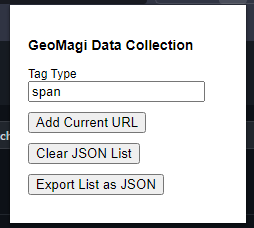

# GeoMagi

> *LLM finetuned on data about geomagnetism*

---

---

## Data Collection

`./extension/` can be loaded into the browser

Users can then use the extension to record viable webpages, along with what tag the page uses to store it's primary content (e.g. span for ``)

Users can export their data to a `.json` file, which can then go to `./data-generation/collected/`

> 

From there, `merge.py` merges all the data into one `scrape-list.json` *[`python merge.py`]*

Finally, `scrape.js` loops through the data and produces `data.txt` *[`npm i && npm run scrape`]*
